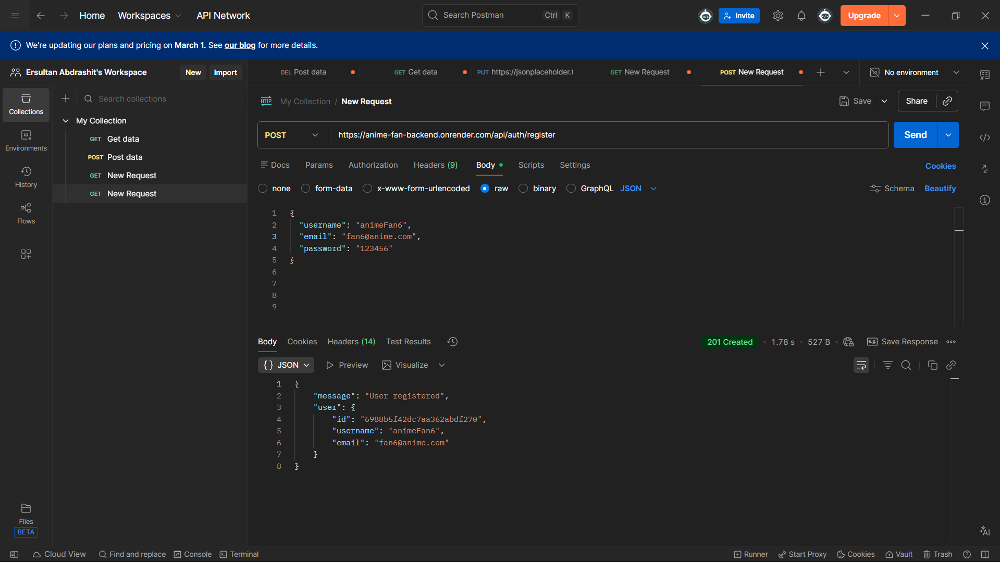
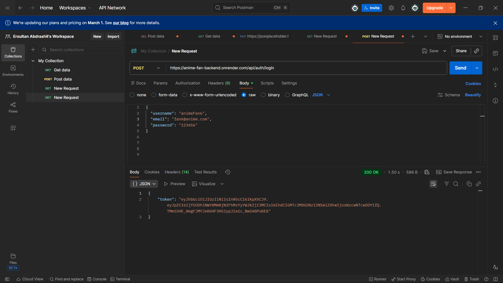
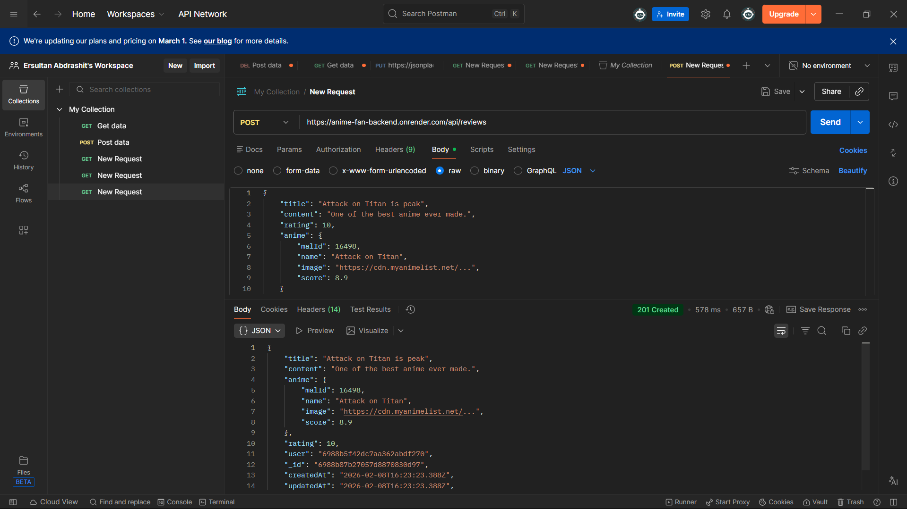

# 🎌 Anime Fan Website – Backend API

## 📌 Project Overview
This is a RESTful backend API for an **Anime Fan Website**.  
Users can register, authenticate using **JWT**, manage their profiles, and create **anime reviews** linked to real anime data fetched from the **Jikan API (MyAnimeList)**.

The project follows a **modular backend architecture** with proper authentication, validation, error handling, and deployment.

---

## 🛠 Tech Stack
- Node.js
- Express.js
- MongoDB Atlas
- Mongoose
- JWT (JSON Web Tokens)
- bcrypt
- Jikan APIb(external anime data source)
- Render (deployment)

### 1️⃣ Clone the repository

git clone https://github.com/Sunaizun/anime-fan-backend.git
cd anime-fan-backend
## Install dependencies
npm install
## Create .env file
PORT=3000
MONGO_URI=your_mongodb_atlas_uri
JWT_SECRET=your_jwt_secret
## Run the server
npm start
## Server will start on:

http://localhost:3000

## Base URLs

Local: http://localhost:3000

Deployed: https://anime-fan-backend.onrender.com

## Authentication & Security

Passwords are hashed using bcrypt

Authentication uses JWT

Protected routes require a valid token

JWT must be sent in request headers:

Authorization: Bearer <your_token>

## Authentication Routes (Public)
Method	|   Endpoint	          |             Description
POST	| /api/auth/register	  |    Register a new user (hashed password)
POST	| /api/auth/login	      |    Authenticate user & return JWT

## User Routes (Private – JWT Required)
Method	|     Endpoint	         |        Description
GET	    | /api/users/profile	 |       Get logged-in user profile
PUT	    | /api/users/profile	 |       Update user profile

## Review Routes (Private – JWT Required)
Method	  |      Endpoint   	 |       Description
POST	  |  /api/reviews	     |  Create a new anime review
GET	      |  /api/reviews	     |   Get all reviews
GET	      |  /api/reviews/:id	 |   Get review by ID
PUT	      |  /api/reviews/:id	 |   Update a review
DELETE	  |  /api/reviews/:id	 |   Delete a review

## External API Integration
Jikan API is used to fetch real anime data from MyAnimeList

No API key required

Used to validate and enrich anime review content

## API Testing
All endpoints were tested using Postman:

register: 
login: 
review: 

## Deployment

Backend deployed on Render

Database hosted on MongoDB Atlas

Environment variables securely stored

Deployed API is fully accessible and tested

## Project Structure
config/
controllers/
middleware/
models/
routes/
server.js
.env
README.md

## Author
Yersultan Abdrashit
Anime Fan Website – Backend API

